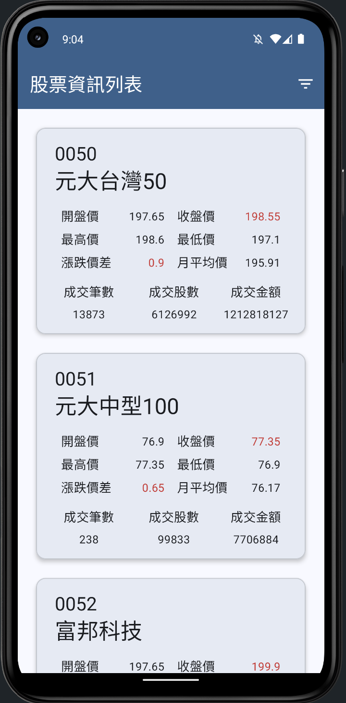
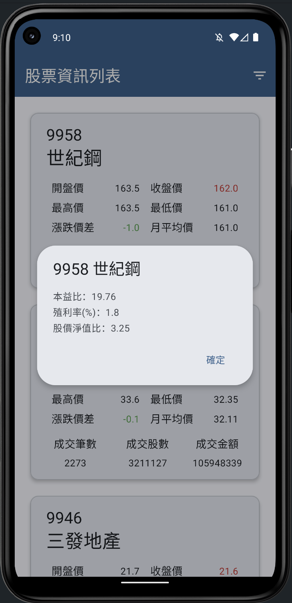
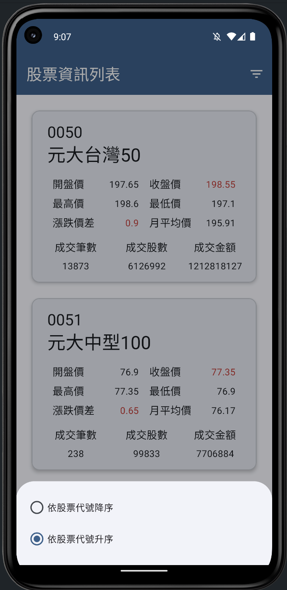
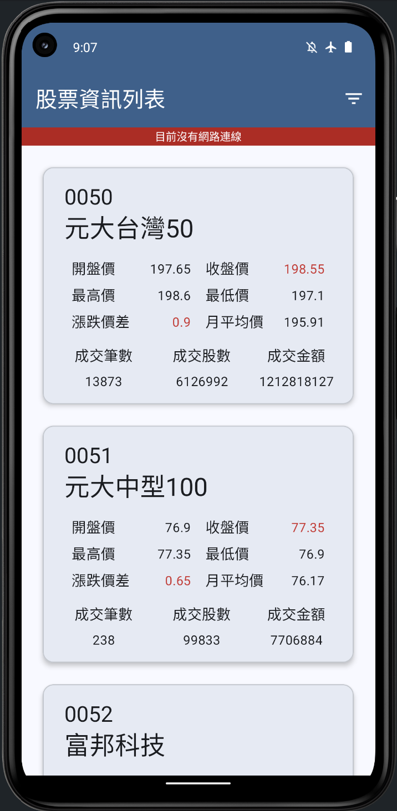
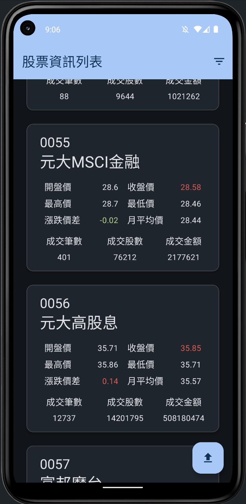
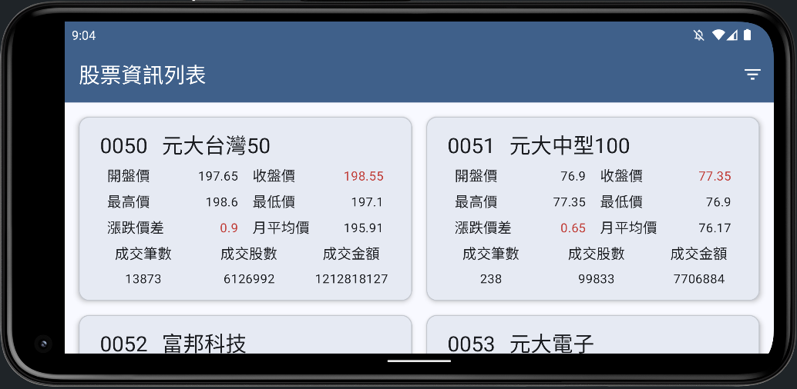

# 台股資訊 TWSE Stock Info

台股資訊 (TWSE Stock Info) 是一款 Android 應用程式，使用 Kotlin 開發，透過 [臺灣證券交易所 API](https://openapi.twse.com.tw/) 取得各檔股票資訊，呈現在畫面上

## 功能

### 1. 即時顯示台股資訊

- 利用 [臺灣證券交易所 API](https://openapi.twse.com.tw/) 取得股票清單及其當日交易資訊
- 使用 Material CardView 方式呈現，每個項目包括基本的開盤、收盤、最高、最低及漲跌價差等資訊

### 2. 台股進階資訊查看

- 點擊 CardView 可顯示詳細資訊(本益比、殖利率、股價淨值比)

### 3. 排序功能

- 右上方排序按鈕開啟 Bottom Sheet，使用者可選擇不同的排序方式，更快聚焦到想要關注的股票

### 4. 排序功能網路狀態監控

- 即時偵測使用者是否處於無網路狀態
- 顯示狀態欄通知使用者當前為無網路狀態
- 在網路恢復後，狀態欄會自動隱藏，並通知使用者網路已連接，重新拉取資料

### 5. 支援 螢幕旋轉 & 深色模式

- 支援水平/垂直螢幕轉向，畫面可自適應
- 支援深色模式與淺色模式的切換，畫面會依據使用者的裝置偏好設定自動調整

## 技術架構

專案採用了 MVVM 架構，並遵循 Clean Architecture 原則進行分層。核心功能使用了以下技術：

- Kotlin
- MVVM
- Dagger Hilt
- Material Design
- ViewBinding
- Coroutines
- Flow
- Room Database
- DataStore
- [OkHttp](https://github.com/square/okhttp)
- [Retrofit](https://github.com/square/retrofit)
- [Kotlinx Serialization](https://github.com/Kotlin/kotlinx.serialization/)
- [Shimmer](https://github.com/facebookarchive/shimmer-android)

## 影片

[Demo 影片](https://youtu.be/v-tNtL3u5ds?si=WJjikh-yG-2qDol6)

## 展示圖

